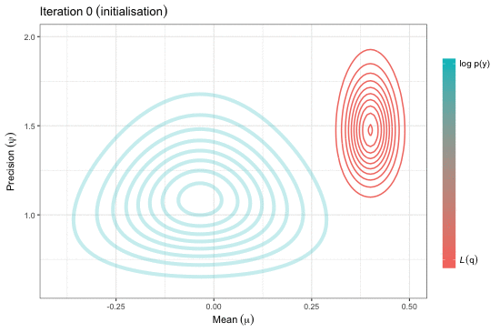

```{r setup, include=FALSE}
knitr::opts_chunk$set(echo = TRUE, prompt = TRUE)
options(prompt = "R> ")

# Load external .R file
# knitr::read_chunk("01-prelim.R")
# knitr::read_chunk("05-iris.R")
# knitr::read_chunk("07-cardiac.R")
# knitr::read_chunk("08-smoking.R")
```

## Abstract

<!-- This talk aims to introduce the concept of variational techniques for estimating statistical models with latent variables.  -->
Estimation of complex models that consists of various latent variables and parameters, in addition to the data that is observed, might involve overcoming an intractable integral.
For instance, obtaining the likelihood of such models require marginalising over the latent variables, and this may prove to be difficult computationally---either due to model design or dimensionality.
Variational inference, or variational Bayes as it is also known as, offers an  efficient alternative to Markov chain Monte Carlo methods, the Laplace approximation, and quadrature methods.
Rooted in Bayesian inference and popularised in machine learning, the main idea is to overcome such difficulties by working with "easy" density functions in lieu of the true posterior distribution.
These approximating density functions are chosen as to minimise the (reverse) Kullback-Leilber divergence between it and the truth.
The main topics that will be discussed are the mean-field variational approximation, the coordinate ascent algorithm, and its properties, with examples following.
The hope is that the audience will gain a basic understanding of the method to possibly spur on further research and applications in their respective work.

*Keywords*: variational, Bayes, inference, expectation, maximisation, EM, propagation, EP, algorithm, coordinate, ascent, Gaussian, mixture, approximation, intractable, Kullback-Leibler, Markov, chain, Monte, Carlo, MCMC

## Links

- Presentation slides - [PDF](http://socialstats.haziqj.ml/soc-stat-meet-bgtvi-handout.pdf)
- Source code - [GitHub](https://github.com/haziqj/soc-stat-meet-bgtvi)

## Supplementary material

#### Variational inference for Gaussian mean and precision



#### Variational inference for mixture of Gaussians


## References

- Bishop, C. M. (2006). _Pattern Recognition and Machine Learning_. Springer. ISBN: [978-0-387-31073-2](http://www.springer.com/gb/book/9780387310732).
- Blei, D. M., Kucukelbir, A., & McAuliffe, J. D. (2017). Variational Inference: A Review for Statisticians. *Journal of the American Statistical Association*, to appear. arXiv: [1601.00670](https://arxiv.org/abs/1601.00670).

***

Copyright (C) 2018 [Haziq Jamil](http://haziqj.ml). 

```{r move, include = FALSE}
file.copy("README.md", "../README.md", overwrite = TRUE)
files <- list.files("README_files/figure-markdown_github")
if (!dir.exists("../README_files/figure-markdown_github")) {
  dir.create("../README_files/")
  dir.create("../README_files/figure-markdown_github")
}
file.copy("README_files/", "../", recursive = TRUE)
```
